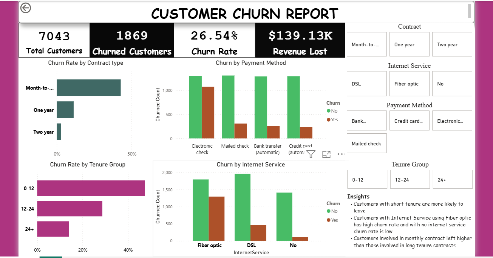

# Customer-Churn-Analysis - Overview
Customer Churn Analysis project focused on identifying key drivers of customer attrition and predicting high-risk customers using SQL, Python, and Power BI. Performed data cleaning, exploratory analysis, and segmentation to uncover churn patterns, and developed a machine learning model for prediction.

## Problem Statement
Customer churn is a critical challenge for subscription-based businesses, directly impacting revenue and growth. The goal of this project is to analyze customer behavior, identify key drivers of churn, and build a predictive model to detect customers at risk of leaving.

## Tools & Technologies
- **SQL** – Data extraction and analysis  
- **Python** – Data cleaning, EDA, feature engineering, machine learning  
- **Power BI** – Interactive dashboard and visualization  
- **Libraries** – Pandas, NumPy, Scikit-learn, Matplotlib, Seaborn  

## Project Workflow

### 1. Data Preparation
- Cleaned missing and inconsistent values  
- Converted data types (e.g., TotalCharges)  
- Created derived features:
  - Tenure Group   
  - Churn Flag
    
### 2. Exploratory Data Analysis (EDA)
- Analyzed churn distribution  
- Identified patterns across:
  - Contract types  
  - Tenure  
  - Payment methods  
  - Monthly charges  

### 3. SQL Analysis
- Performed segmentation analysis using SQL  
- Key queries included:
  - Churn rate by contract  
  - Churn by tenure group   

### 4. Machine Learning
- Built classification models using Logistic Regression, Decision Tree and Random Forest to predict churn
- Evaluated the models based on confusion matrix and classification report  
- Applied:
  - SMOTE for class imbalance  
  - Hyperparameter tuning  
- Observed **precision-recall trade-off**  
- Improved performance by **threshold tuning** instead of relying on default 0.5  

### 5. Dashboard (Power BI)
Developed an interactive dashboard showing:
- Total customers  
- Churn rate  
- Revenue lost  
- Churn by segments (contract, tenure, payment)

## Key Insights
- Customers on **month-to-month contracts** show highest churn  
- **Low tenure customers** are more likely to leave  
- **Higher monthly charges** increase churn probability  
- Certain **payment methods** that are not automatic are associated with higher churn  

## Business Recommendations
- Encourage long-term contracts with incentives  
- Target new customers with retention strategies  
- Offer personalized plans for high-risk segments  
- Monitor high-value customers closely  

## Model Insight
The model exhibited a **precision-recall trade-off**, where improving recall reduced precision.  
To address this:
- Evaluated multiple thresholds  
- Selected optimal threshold based on **F1-score and business needs**  

##  Dashboard Preview

